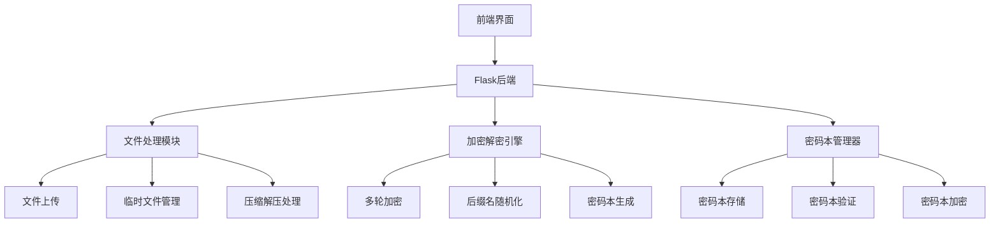

# 基于Flask的文件加密解密系统实施计划

## 项目概述

本项目基于Flask框架实现文件加密解密系统，通过多轮压缩和修改后缀名的方式实现文件加密，并生成密码本记录加密过程。系统支持批量操作，满足个人文件轻量加密需求。

**开发环境**: Windows 11本地开发
**核心目标**: 实现基础加密解密功能，无需用户登录系统

## 项目架构



## 项目结构

```
file-encryption-system/
├── app.py                 # Flask主应用
├── requirements.txt       # Python依赖包
├── config.py             # 应用配置
├── static/               # 静态资源
│   ├── css/
│   │   └── style.css
│   ├── js/
│   │   └── main.js
│   └── uploads/          # 临时上传目录
├── templates/            # HTML模板
│   ├── base.html
│   ├── index.html
│   ├── upload.html
│   ├── encrypt.html
│   ├── decrypt.html
│   ├── password_books.html
│   └── result.html
└── utils/                # 核心工具模块
    ├── __init__.py
    ├── file_processor.py # 文件处理
    ├── encryption_engine.py # 加密引擎
    └── password_book.py  # 密码本管理
```

## 第一阶段：核心功能实现

### 1. 环境搭建与依赖管理

**requirements.txt**
```txt
Flask==2.3.3
Flask-Uploads==0.2.1
Werkzeug==2.3.7
cryptography==41.0.4
```

### 2. 配置文件 (config.py)

```python
import os

class Config:
    SECRET_KEY = os.environ.get('SECRET_KEY') or 'dev-secret-key'
    MAX_CONTENT_LENGTH = 500 * 1024 * 1024  # 500MB
    UPLOAD_FOLDER = 'static/uploads'
    ALLOWED_EXTENSIONS = {
        'txt', 'pdf', 'png', 'jpg', 'jpeg', 'gif', 'zip', 
        'tar', 'gz', 'bz2', 'doc', 'docx', 'xls', 'xlsx',
        'mp3', 'mp4', 'avi', 'mov'
    }
    DENIED_EXTENSIONS = {'exe', 'sh', 'bat', 'cmd', 'msi'}
    
    # 压缩算法支持
    COMPRESSION_ALGORITHMS = ['zip', 'tar', 'gzip', 'tar.gz', 'tar.bz2']
    
    # 后缀名池
    EXTENSION_POOL = [
        '.txt', '.jpg', '.pdf', '.docx', '.mp3', '.mp4', 
        '.png', '.xlsx', '.zip', '.tar', '.gz'
    ]
```

### 3. 文件处理模块 (utils/file_processor.py)

**核心功能**:
- 文件上传验证
- 临时文件管理
- 压缩/解压操作
- 文件后缀修改

**关键方法**:
```python
def validate_file(file):
    """验证上传文件"""
    pass

def save_uploaded_file(file):
    """保存上传文件到临时目录"""
    pass

def compress_file(file_path, algorithm):
    """使用指定算法压缩文件"""
    pass

def extract_file(file_path, algorithm):
    """使用指定算法解压文件"""
    pass

def change_extension(file_path, new_extension):
    """修改文件后缀名"""
    pass

def cleanup_temp_files():
    """清理临时文件"""
    pass
```

### 4. 加密引擎模块 (utils/encryption_engine.py)

**核心功能**:
- 多轮加密逻辑
- 随机算法选择
- 轮数计算
- 密码本生成

**关键方法**:
```python
def calculate_rounds(user_input=None, manual_rounds=3):
    """计算加密轮数"""
    if user_input:  # 特定代码生成
        hash_value = hashlib.md5(user_input.encode()).hexdigest()
        return (int(hash_value[:2], 16) % 10) + 1
    return manual_rounds

def multi_round_encrypt(file_path, rounds, algorithms):
    """多轮加密主函数"""
    current_file = file_path
    password_book = {}
    
    for round_num in range(1, rounds + 1):
        # 1. 压缩
        algorithm = random.choice(algorithms)
        compressed_file = compress_file(current_file, algorithm)
        
        # 2. 修改后缀名
        new_extension = random.choice(EXTENSION_POOL)
        encrypted_file = change_extension(compressed_file, new_extension)
        
        # 记录到密码本
        password_book[round_num] = {
            'extension': new_extension,
            'algorithm': algorithm
        }
        
        # 清理中间文件
        if current_file != file_path:
            os.remove(current_file)
        current_file = encrypted_file
    
    return current_file, password_book

def multi_round_decrypt(file_path, password_book):
    """多轮解密主函数"""
    pass
```

### 5. 密码本管理器 (utils/password_book.py)

**核心功能**:
- JSON密码本生成
- 密码本验证
- 密码本加密
- 批量处理

**关键方法**:
```python
def generate_password_book(encryption_data):
    """生成密码本"""
    pass

def validate_password_book(password_book):
    """验证密码本格式"""
    pass

def encrypt_password_book(password_book, password):
    """加密密码本"""
    pass

def decrypt_password_book(encrypted_book, password):
    """解密密码本"""
    pass

def merge_password_books(books_dict):
    """合并多个密码本"""
    pass
```

### 6. Flask主应用 (app.py)

**路由设计**:
```python
@app.route('/')
def index():
    """首页"""
    pass

@app.route('/upload', methods=['GET', 'POST'])
def upload():
    """文件上传"""
    pass

@app.route('/encrypt', methods=['GET', 'POST'])
def encrypt_config():
    """加密配置页面"""
    pass

@app.route('/process_encrypt', methods=['POST'])
def process_encrypt():
    """执行加密"""
    pass

@app.route('/decrypt', methods=['GET', 'POST'])
def decrypt_config():
    """解密配置页面"""
    pass

@app.route('/process_decrypt', methods=['POST'])
def process_decrypt():
    """执行解密"""
    pass

@app.route('/password_books', methods=['GET', 'POST'])
def password_books():
    """密码本管理"""
    pass

@app.route('/download/<file_id>')
def download_file(file_id):
    """文件下载"""
    pass
```

### 7. 前端界面实现

**技术栈**:
- Bootstrap 5 (响应式布局)
- HTML5 File API
- JavaScript (进度条、表单验证)

**主要页面**:
- `index.html` - 功能入口
- `upload.html` - 文件上传
- `encrypt.html` - 加密配置
- `decrypt.html` - 解密配置  
- `password_books.html` - 密码本管理
- `result.html` - 操作结果

## 第二阶段：功能完善

### 1. 批量操作支持

**批量加密**:
- 多文件同时处理
- 统一加密参数
- 合并密码本生成

**批量解密**:
- 多文件+密码本匹配
- 自动文件名关联
- 批量下载打包

### 2. 用户体验优化

**功能增强**:
- 实时进度显示
- 操作历史记录
- 文件预览功能
- 错误友好提示

## 开发时间规划

### 第一阶段 (核心功能) - 6-8天

| 任务 | 时间 | 优先级 |
|------|------|--------|
| 项目框架搭建 | 1天 | 高 |
| 文件处理模块 | 1-2天 | 高 |
| 加密引擎实现 | 2天 | 高 |
| 基础前端界面 | 1-2天 | 高 |
| 集成测试 | 1天 | 中 |

### 第二阶段 (功能完善) - 2-3天

| 任务 | 时间 | 优先级 |
|------|------|--------|
| 批量操作功能 | 1天 | 中 |
| 用户体验优化 | 1天 | 中 |
| 最终测试 | 1天 | 中 |

**总开发时间**: 8-11个工作日

## 技术实现要点

### 安全考虑
1. **文件安全**
   - 临时文件及时清理
   - 文件类型白名单验证
   - 最大文件大小限制

2. **密码本安全**
   - 可选AES加密
   - 格式严格验证
   - 元数据完整性校验

3. **会话安全**
   - 文件访问会话隔离
   - 临时目录权限控制

### 性能优化
1. **大文件处理**
   - 流式读取避免内存溢出
   - 分块处理大文件

2. **并发处理**
   - 文件操作锁机制
   - 临时文件命名唯一性

### 错误处理
1. **文件操作错误**
   - 压缩解压失败处理
   - 磁盘空间不足检测

2. **用户输入验证**
   - 轮数范围验证
   - 文件格式验证
   - 密码本格式验证

## 测试策略

### 单元测试
- 文件处理功能测试
- 加密解密逻辑测试
- 密码本生成验证测试

### 集成测试
- 完整加密解密流程测试
- 批量操作功能测试
- 边界条件测试（大文件、多轮次）

### 用户验收测试
- 界面操作流程测试
- 错误场景处理测试
- 性能压力测试

## 部署说明

### 本地开发部署
```bash
# 1. 创建虚拟环境
python -m venv venv
venv\Scripts\activate  # Windows

# 2. 安装依赖
pip install -r requirements.txt

# 3. 运行应用
python app.py
```

### 生产环境建议
- 使用Gunicorn或uWSGI
- 配置Nginx反向代理
- 设置适当的文件存储策略

## 扩展性考虑

### 未来功能扩展
1. 更多压缩算法支持（7z等）
2. 密码本分享功能
3. 文件分片传输
4. 云存储集成

### 架构扩展
1. 数据库支持用户管理
2. 分布式文件存储
3. 微服务架构拆分

---

**文档版本**: 1.0  
**创建时间**: 2025-11-02  
**最后更新**: 2025-11-02